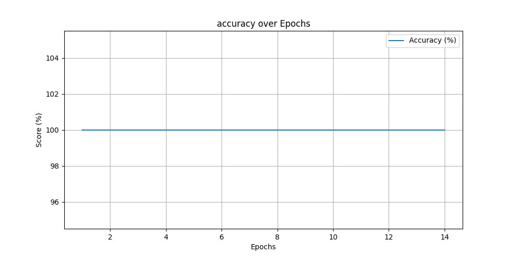
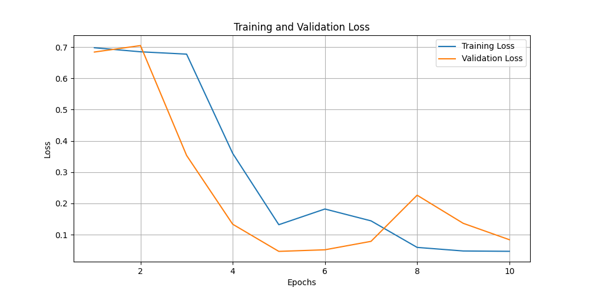
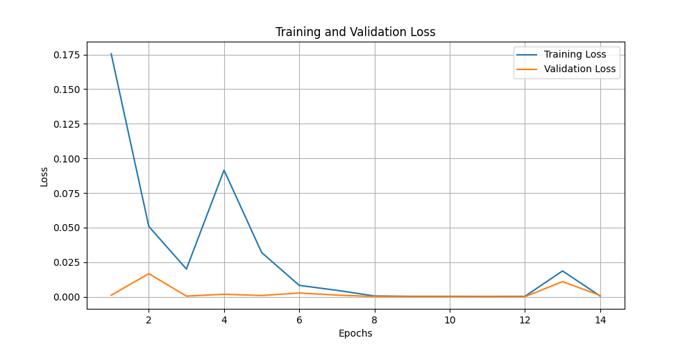
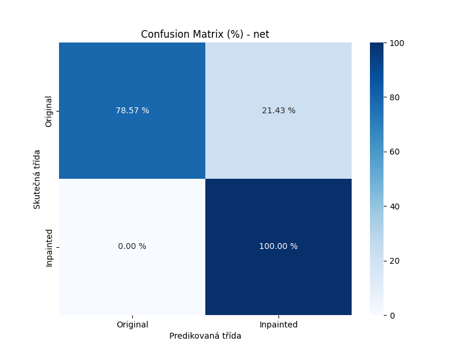
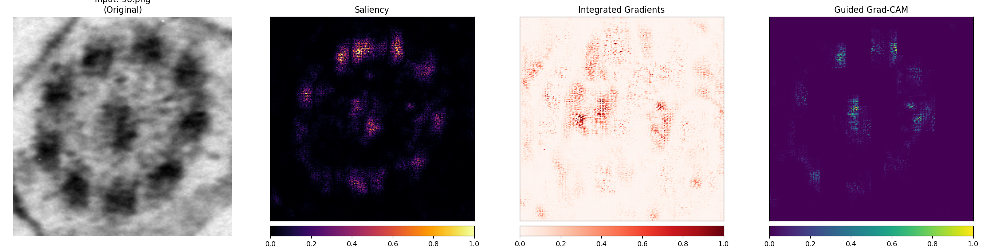
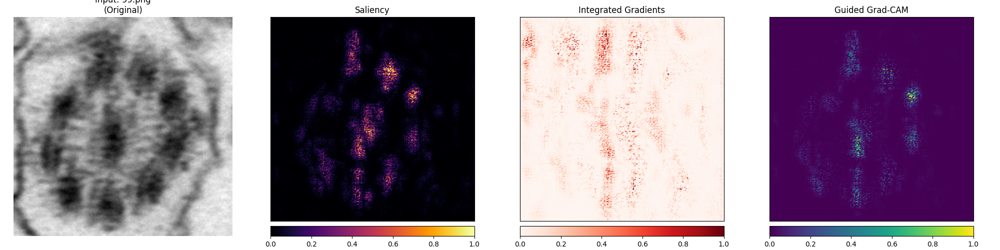
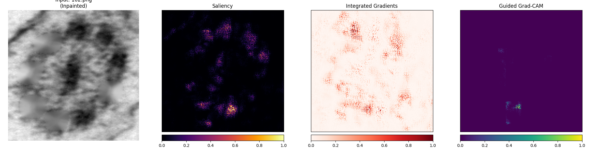
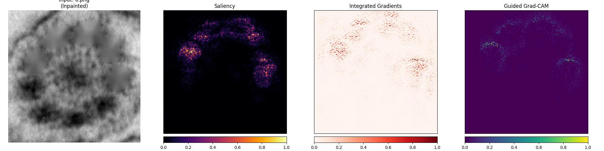
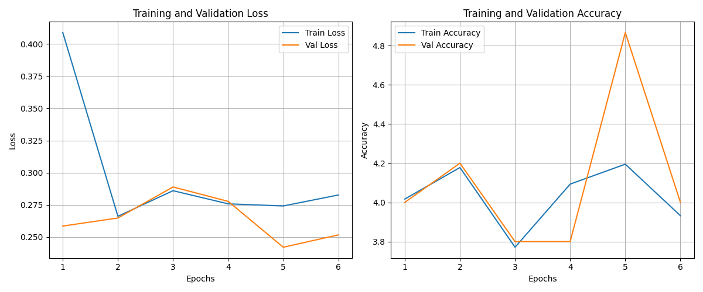
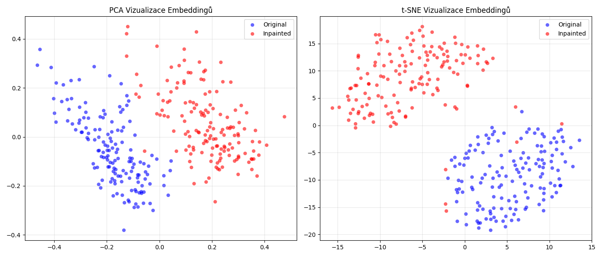

# Assignment 3

> Author: Kryštof Čejchan

## Objective
Implementace a evaluace klasifikačních modelů (CNN), analýza jejich rozhodování (XAI) a Siamské sítě.
## Part 1: Classification (Original vs. Inpainted)

### Příprava datasetu

Dataset byl připraven z bitmapových obrazů z předešlých úloh. Dohromady měl dataset ± 300 obrazů, z toho 50% bylo inpainted a zbytek byl ponechán beze změn (50%).

Pro inpainted byly použity masky cílií, které byly zdilatovány a následně pomocí funkce `cv.inpaint` bylo nejméně pět náhodných buněk "překresleno".


### Modely CNN

#### Vlastní síť

Feature Extractor: Série pěti konvolučních bloků, které postupně snižují prostorovou dimenzi obrazu a zvyšují hloubku příznaků (počet kanálů).

Klasifikátor: Plně propojené (Fully Connected) vrstvy, které převádějí extrahované příznaky na finální predikci.

Na vstupu je greyscale obrázek (tj. jeden kanál) s rozlišením 256x256. Další vrstvy jsou následujicí:


| Část sítě    | Vrstva | Typ Operace      | Konfigurace                  | Výstupní Tenzor |
|:-------------|:-------|:-----------------|:-----------------------------|:----------------|
| Vstup        | -      | -                | -                            | (1, 256, 256)   |
| Blok 1       | conv1  | Konvoluce + ReLU | k=5, s=1, p=2                | (16, 256, 256)  |
| -            | pool1  | Max Pooling      | k=2, s=2                     | (16, 128, 128)  |
| Blok 2       | conv2  | Konvoluce + ReLU | k=5, s=1, p=2                | (32, 128, 128)  |
| -            | pool2  | Max Pooling      | k=2, s=2                     | (32, 64, 64)    |
| Blok 3       | conv3  | Konvoluce + ReLU | k=3, s=1, p=1                | (64, 64, 64)    |
| -            | pool3  | Max Pooling      | k=2, s=2                     | (64, 32, 32)    |
| Blok 4       | conv4  | Konvoluce + ReLU | k=3, s=1, p=1                | (128, 32, 32)   |
| -            | pool4  | Max Pooling      | k=2, s=2                     | (128, 16, 16)   |
| Blok 5       | conv5  | Konvoluce + ReLU | k=3, s=1, p=1                | (256, 16, 16)   |
| -            | pool5  | Max Pooling      | k=2, s=2                     | (256, 8, 8)     |
| Flatten      | -      | Zploštění        | -                            | (256 * 64)      |
| Klasifikátor | fc1    | Linear + ReLU    | Vstup: 256 * 64, Výstup: 512 | (512)           |
| -            | fc2    | Linear + ReLU    | Vstup: 512, Výstup: 128      | (128)           |
| -            | fc3    | Linear (Logits)  | Vstup: 128, Výstup: 2        | (2)             |

`k = kernel_size; s = stride; p = padding`


#### Transfer learning

Standardní ResNet18 je navržen pro barevné RGB obrázky (3 kanály) a klasifikaci do 1000 tříd. Pro potřeby této úlohy (greyscale obrázky [1 kanál], klasifikace do 2 tříd) byly provedeny následující modifikace:

1. Adaptace vstupní vrstvy (Grayscale)
    
    Původní vstupní konvoluční vrstva (conv1) očekává 3 vstupní kanály (RGB). Jelikož pracujeme s černobílými (grayscale) obrázky (1 kanál), byla tato vrstva nahrazena novou konvolucí:
    
    Původní: in_channels=3
    Nová: in_channels=1 (ostatní parametry jako kernel size, stride a padding zůstaly zachovány).
    
    Aby se nepřišlo o naučené informace z RGB verze, váhy nové vrstvy nebyly inicializovány náhodně. Místo toho byl vypočítán průměr vah přes původní 3 kanály.
    
    ```py
    self.model.conv1.weight.data = original_conv1.weight.data.mean(dim=1, keepdim=True)
    ```
    
    Tato technika umožňuje síti reagovat na strukturní rysy v černobílém obraze podobně, jako by reagovala na jasovou složku barevného obrazu.

2. Úprava klasifikační hlavy (Head)

    Původní plně propojená vrstva (fc), která mapovala příznaky na 1000 tříd ImageNetu, byla odstraněna a nahrazena novou lineární vrstvou odpovídající našemu zadání:
    
    Vstup: 512 příznaků (výstup z posledního ResNet bloku).
    
    Výstup: num_classes (v našem případě 2: Original vs. Inpainted).

3. Strategie trénování (Freezing)

    Třída podporuje parametr freeze_base, který umožňuje zmrazit váhy extraktoru příznaků:
    
    Pokud freeze_base=True: Gradienty se počítají pouze pro novou klasifikační hlavu (fc). To je vhodné pro rychlé doladění (fine-tuning), kdy předpokládáme, že naučené příznaky z ImageNetu jsou dostatečně obecné.
    
    Pokud freeze_base=False (výchozí v kódu): Trénuje se celá síť. Váhy z ImageNetu slouží jako velmi kvalitní startovní bod inicializace, ale během tréninku se jemně přizpůsobují specifikům datasetu cílií.

### Trénink

1. Rozdělení a příprava dat

    Data jsou načítána z adresářové struktury, kde jsou třídy (original, inpainted) odděleny do podadresářů. Před samotným trénováním probíhá následující zpracování:
    
    Rozdělení datasetu: Všechny dostupné snímky jsou náhodně zamíchány a rozděleny na tři disjunktní sady na základě definovaných poměrů (70/15/15):
    
    Trénovací sada: Slouží k optimalizaci vah modelu.
    
    Validační sada: Slouží k průběžnému vyhodnocování modelu a rozhodování o předčasném ukončení (Early Stopping).
    
    Testovací sada: Použita výhradně po skončení trénování pro finální změření výkonnosti modelu.
    
    Data Augmentace: Pro zvýšení robustnosti modelu a prevenci přeučení (overfitting) je na trénovací sadu aplikována augmentace dat ve formě rotací o 90°, 180° a 270°. Validační a testovací sady zůstávají bez rotací (úhel 0°).

2. Konfigurace trénování

    Pro optimalizaci modelu byly zvoleny následující parametry a komponenty:
    
    Ztrátová funkce: Byla použita CrossEntropyLoss
    
    Optimalizátor: Byl zvolen algoritmus Adam (Adaptive Moment Estimation), který efektivně přizpůsobuje rychlost učení pro jednotlivé parametry sítě.
    
    Model: Skript využívá třídu ResNetClassifier nebo Net (podle toho, zda se jedná o transfer learning nebo ne), která je inicializována a přesunuta na výpočetní zařízení CPU.

3. Trénovací smyčka a Early Stopping

    Trénování probíhá v cyklech (epochách). Každá epocha se skládá ze dvou fází:
    
    Trénovací fáze (model.train()):
    
    Model zpracovává data po dávkách (batches).
    
    Pro každou dávku se vypočítá chyba (loss), provedou se zpětné propagace (backpropagation) a aktualizují se váhy pomocí optimalizátoru.
    
    Validační fáze (model.eval()):    
    Model je přepnut do evaluačního režimu (vypnutí dropoutu, fixace batch norm).
    
    Bez výpočtu gradientů (torch.no_grad()) se provede predikce na validační sadě.
    
    Výpočet metrik: Výstupy sítě (logity pro 2 třídy) jsou transformovány na binární predikci rozdílem skóre (class_1 - class_0), což umožňuje výpočet Accuracy, Precision, Recall a F1-Score pomocí třídy Metrics.
    
    Strategie Early Stopping (Předčasné zastavení): Aby se předešlo přeučení a plýtvání výpočetním časem, je implementován mechanismus Early Stopping.
    
    Monitoruje se hodnota validační ztráty (validation loss).
    
    Pokud je aktuální validační ztráta nižší než doposud nejlepší zaznamenaná, model (jeho váhy) se uloží jako nejlepší kandidát.
    
    Pokud se ztráta nezlepší po stanovený počet epoch (parametr PATIENCE), trénování je automaticky ukončeno.

4. Vizualizace a finální testování

    Po ukončení tréninku skript generuje grafy průběhu:
    
    Loss Graph: Porovnání vývoje trénovací a validační chyby v čase.
    
    Accuracy Graph: Vývoj přesnosti modelu na validační sadě.
    
    V poslední fázi se načtou váhy modelu s nejnižší validační chybou (nikoliv váhy z poslední epochy) a provede se inferenece na testovací sadě.
    
    Snímky jsou na základě predikce fyzicky roztříděny do složek predicted_original a predicted_inpainted pro vizuální kontrolu.
    
    Jsou vypočítány finální metriky výkonnosti na datech, která model během tréninku nikdy neviděl.

### Výstupy
Moje síť:


Transfer learning:



Moje síť:



Transfer learning:




Moje síť:



| Metrika   | Skóre  |
|-----------|--------|
| Precision | 0.7391 |
| Recall    | 1.0000 |
| F1-Score  | 0.8500 |
| IoU       | 0.7391 |


Transfer learning:


| Metrika   | Skóre  |
|-----------|--------|
| Precision | 1.0000 |
| Recall    | 1.0000 |
| F1-Score  | 1.0000 |
| IoU       | 1.0000 |


## Part 2: Model Interpretability

Pro validaci rozhodovacího procesu neuronové sítě a ověření, zda se model zaměřuje na relevantní vizuální znaky, byla implementována sada metod pro vysvětlitelnou umělou inteligenci (Explainable AI - XAI). K tomuto účelu byla využita knihovna Captum, která umožňuje analyzovat příspěvky jednotlivých pixelů k finální predikci modelu.

Analýza byla provedena na natrénovaném modelu (Net nebo ResNetClassifier) s využitím tří odlišných gradientních metod. Každá z nich poskytuje jiný pohled na to, co model považuje za důležité.

Použité metody vizualizace

1. Saliency (Gradient-based):

    Základní metoda, která počítá gradient výstupu vzhledem ke vstupnímu obrázku. Výsledná mapa indikuje, které pixely by při malé změně nejvíce ovlivnily výsledné skóre třídy.
    
    Vizualizace: Používá absolutní hodnotu gradientů (sign="absolute_value") a barevnou mapu inferno, aby zvýraznila oblasti s nejvyšší citlivostí bez ohledu na směr vlivu.


2. Integrated Gradients (IG):
    
    Tato metoda řeší problém saturace gradientů integrováním gradientů podél cesty od referenčního "nulového" vstupu (černý obrázek) k aktuálnímu vstupu. Poskytuje stabilnější a méně zašuměné výsledky než prostá Saliency mapa.
    
    Vizualizace: Zobrazuje pouze pozitivní příspěvky (sign="positive", mapa Reds), tedy ty oblasti, které přímo zvyšují pravděpodobnost predikované třídy.

3. Guided Grad-CAM:

    Kombinuje lokalizační schopnost metody Grad-CAM s detailním rozlišením Guided Backpropagation. Tato metoda sleduje aktivace v poslední konvoluční vrstvě sítě, která obsahuje nejvyšší úroveň sémantické informace.
    
    Konfigurace: Jako cílová vrstva (target_layer) byla pro vlastní síť Net zvolena vrstva conv5 (u ResNetu by to byl poslední blok layer4). Tato vrstva slouží jako zdroj pro výpočet vah důležitosti jednotlivých map příznaků.
    
    Vizualizace: Výstupem je detailní mapa (mapa viridis), která zvýrazňuje klíčové struktury (např. hrany nebo textury řasinek) vedoucí k rozhodnutí.

### Moje síť








### Resnet




### Porovnání (moje síť vs resnet)


## Part 3: Siamese Networks
Pro úlohu detekce inpaintingu byla implementována Siamská neuronová síť (Siamese Neural Network). Na rozdíl od klasických klasifikačních sítí, které se učí přiřadit vstupu konkrétní třídu, se siamská síť učí metriku podobnosti. Cílem je transformovat vstupní obrázky do vektorového prostoru (embedding space) tak, aby vektory obrázků stejné třídy byly blízko u sebe a vektory rozdílných tříd daleko od sebe.

1. Architektura modelu
    
    Jako základ (backbone) modelu byl zvolen ResNet18, předtrénovaný na ImageNetu, což zajišťuje robustní extrakci příznaků.
    
    Adaptace vstupu: Jelikož vstupní data jsou černobílá (1 kanál), byla první konvoluční vrstva ResNetu modifikována. Původní váhy pro 3 RGB kanály byly zprůměrovány do jednoho kanálu, což umožňuje využít předtrénované informace i pro grayscale vstupy.
    
    Sdílené váhy: Síť se skládá ze dvou identických větví, které sdílejí tytéž váhy. Oba obrázky z páru procházejí stejnou transformací.
    
    Embedding vrstva: Původní klasifikační hlava ResNetu byla nahrazena sekvencí Linear -> ReLU -> Linear, která mapuje extrahované příznaky do 128-dimenzionálního výstupního vektoru.

2. Příprava dat a párování

    Pro trénování siamské sítě je klíčová tvorba párů. Třída SiameseDataset generuje trénovací vzorky dynamicky:

    Pozitivní pár (Label 0): Dva různé obrázky stejné třídy (např. Original–Original nebo Inpainted–Inpainted).
    
    Negativní pár (Label 1): Dva obrázky rozdílných tříd (Original–Inpainted).
    
    Vyvážení: Dataset je konstruován tak, aby pravděpodobnost výběru pozitivního a negativního páru byla 50:50, což zabraňuje biasu sítě k jedné z variant.

3. Ztrátová funkce (Contrastive Loss)

    K optimalizaci vah byla použita funkce Contrastive Loss. Tato funkce pracuje s Euklidovskou vzdáleností Dw 
    mezi výstupními vektory sítě.

4. Průběh trénování

    Trénování probíhá pomocí optimalizátoru Adam s learning rate 0.0005.
    
    Evaluace přesnosti: Přesnost modelu není měřena klasicky, ale na základě prahování vzdálenosti. Pokud je vzdálenost mezi vektory menší než threshold=margin/2, je pár klasifikován jako "shodný".
    
    Early Stopping: Pro zabránění přeučení je monitorována validační ztráta (Loss). Pokud se nezlepší po stanovený počet epoch (PATIENCE), trénování je předčasně ukončeno a uloží se model s nejnižší validační chybou.

### Metriky
#### VÝSLEDKY EVALUACE (Threshold=0.5)
| Metrika  | Skóre |
|----------|-------|
| Accuracy | 0.6   |
| Recall   | 0.72  |
| F1-Score | 0.51  |
| IoU      | 0.6   |

| Metrika  | Skóre |
|----------|-------|
| Accuracy | 0.6   |
| Recall   | 0.72  |
| F1-Score | 0.51  |
| IoU      | 0.6   |

| Třída (Class)    | Precision | Recall | F1-Score | Support |
|:-----------------|:---------:|:------:|:--------:|:-------:|
| **Stejné (0)**   |   0.51    |  0.72  |   0.60   |   25    |
| **Různé (1)**    |   0.72    |  0.51  |   0.60   |   35    |
|                  |           |        |          |         |
| **Accuracy**     |           |        | **0.60** | **60**  |
| **Macro Avg**    |   0.62    |  0.62  |   0.60   |   60    |
| **Weighted Avg** |   0.63    |  0.60  |   0.60   |   60    |





