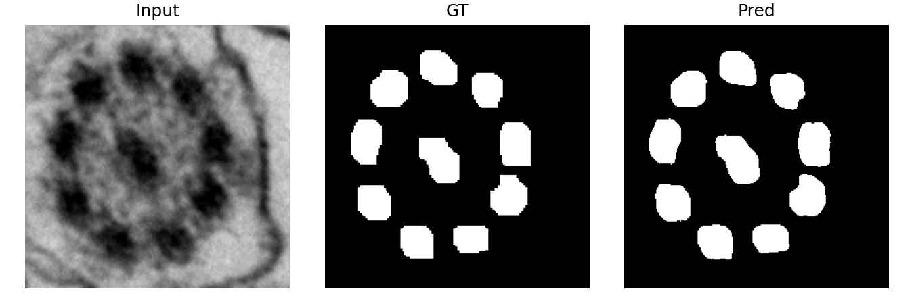
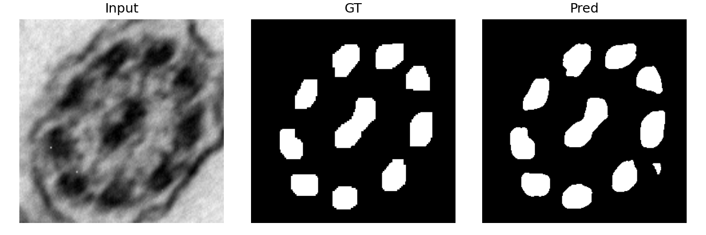
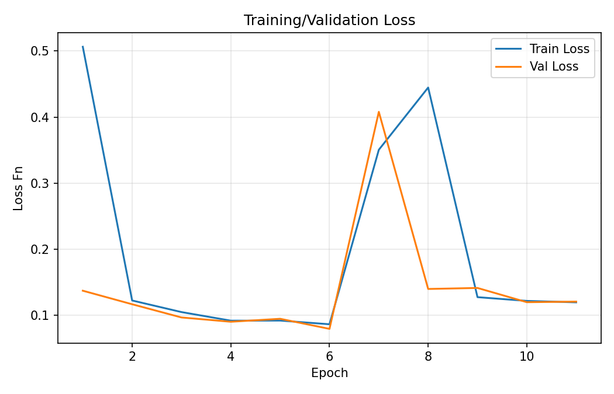
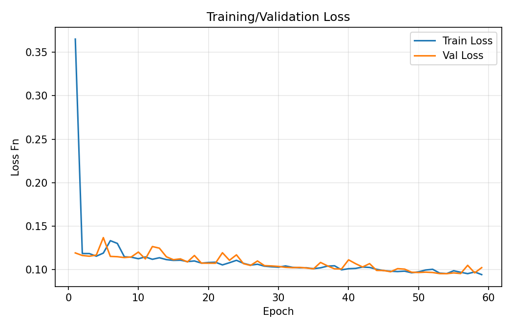
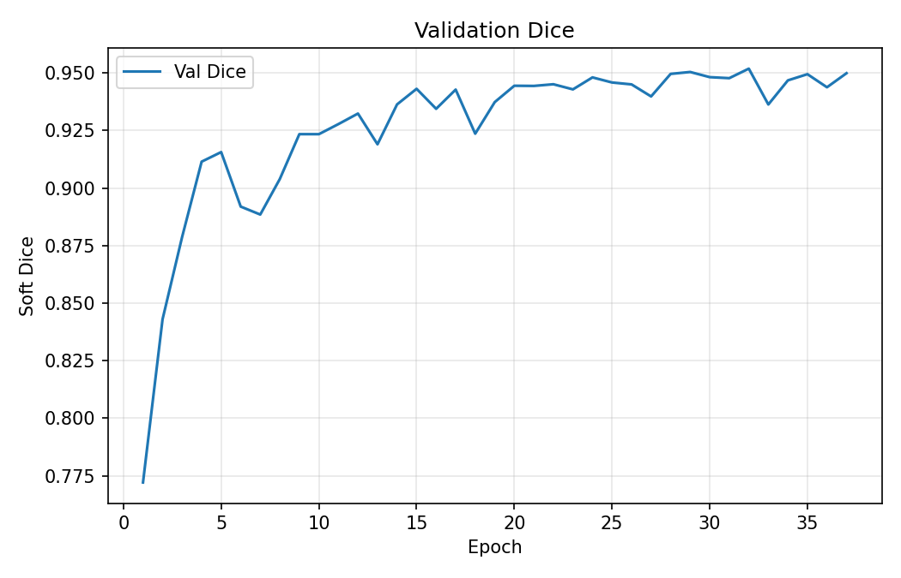
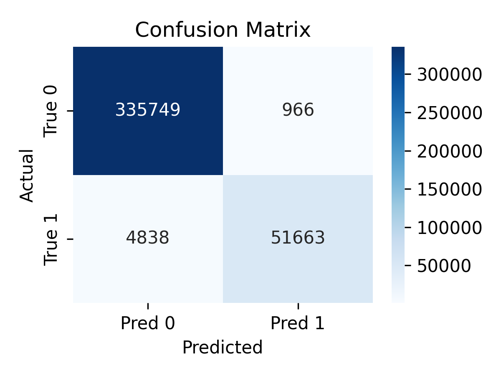
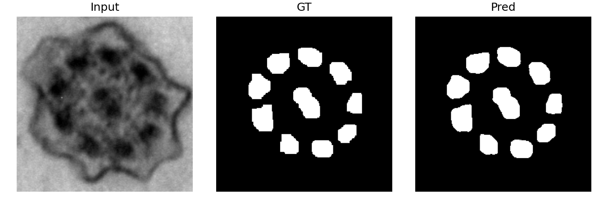
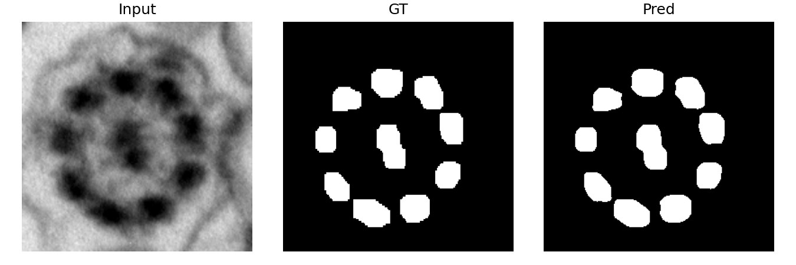

# Assingment 02

Cílem tohoto úkolu bylo využít dataset z prvního úkolu a natrénovat na něm síť U-Net.



## Part 1: Dataset Preparation

Dataset se skládal ze zkruba 300 obrázků z prvního úkolu,
přičemž došlo ke změně, a to sice že se odstranila černá úsečka rozdělující prostřední tobuli cílie.
Dataset byl rozdělen na originální obrázky cílií a jejich černobílé masky.

Originální bitmapové obrázky byly načteny jako grey-scale a zvětšeny na rozlišení 256x256 pixelů pomocí bilineární interpolace.
Stejně byly načteny i masky, které ovšem byly zvětšeny pomocí interpolace nejbližího souseda, což v tomto případě šlo pro vést relativně bezproblémově, neboť se jedná o černobílé obrázky.

Pro zvětšení velikosti vstupního datasetu byla použita augmentace v podobě rotace obrázů o 90°, 180° a 270°. Díky takto zvoleným rotacím se nemuselo řešit, co se stane s prázným místem, kdybychom obrázek otočili o např. 45°. Také bylo zjištěno, že při zvýšení počtu rotací (např. kdybychom rotovali obrázek o 15°), tak by trénování sítě zabralo příliš mnoho času (za předpokladu, že bychom nenastavili počet epoch na nějaký nízký počet).

## Part 2: U-Net Architecture

U-Net je realizován v pětivrstvé architektuře (5 downsample bloků následovaných bottleneckem a 5 upsample bloky). Počet konvolučních filtrů na vstupní vrstvě je 16; v každém dalším stupni encoderu se počet filtrů zdvojnásobuje (tzn. 16, 32, 64, 128, 256). Zvhledem k tomu, že obrázek je na vstupu 256x256, tak se po poolováních v enkóderu dostane na 16x16.
Decoder je symetrický k encoderu a v jednotlivých úrovních postupně snižuje počet kanálů zpět na 16, přičemž využívá skip connection spojující odpovídající vrstvy.

Při implementaci výsledného řešení byly otestovány i některé úpravy, které ovšem nefungovaly dostatečně efektivně a proto nebyly použity. Mezi těmito úpravami bylo: 1） snížení počtu vrstev na 2, to způsobilo, že síť označovala některé části jako false positive.



2） Počet konvolučních filtrů na vstupní vrstvě byl nastaven na 32. Toto vedlo ke zvýšení výpočetní složitosti při trénování, aniž by se dostavily nějaké změny na efektivnosti výsledné sítě. Proto se zvolilo počátečních 16.

## Part 3: Model Training

Trénování modelu využívalo vytvořenou U-Netu, rozdělení datasetu na tři části, kombinaci dvou loss funkcí a early-stopping.

### Rozdělení datasetu

Dataset se rozdělil na tři části: trénovací, validační a testovací. Poměr těchto skupin by 70/15/15. Tento počet byl zvolen vzhledem k velikosti datasetu, jeho augmentaci a také protože to bylo zmíněno na přednášce.

```python
train_size = int(0.7 * len(ds)) # 70%
val_size   = int(0.15 * len(ds)) # 15%
test_size  = len(ds) - train_size - val_size # 100-70-15 = 15%
```

### Batch size

Při trénování byl také zvolen batch size 8 primárně kvůli mé velikosti paměti, každopádně podle mého neformálního výzkumu, by zvýšení batch size na 16 či 32 nemělo výrazný efekt.

### Ztrátová funkce

Při trénování modelu byly vyzkoušeny dvě loss funkce, a to sice dice loss, binary cross-entropy loss a následně i jejich kombinace. Tato kombinace využívala obou funkcí zároveň, přičemž jejich poměr byl určován hodnotou alpha, která určovala "váhu" BCE. Např. pokud alpha=0.8, tak BCE mělo váhu 80% a dice pouze 20%; pokud by alpha=0.5, funkce by měly stejnou váhu.

Nakonec se nejvíce osvědčilo použít buď BCE nebo dice; jejich kombinace měla úspěch pouze pokud byla alpha velmi nízká.

### Early stop a počet epoch

Počet epoch a early-stop spolu úzce souvisí, proto je popíši v rámci jedné podkapitoly.

Počet epoch byl nastaven na 120, ovšem kvůli early-stop algoritmu se trénovací algoritmus dostal nejvýše na 30.

Early-stop algoritmus po každé epoše zkontroluje validation loss; pokud se "zlepšila", tak algoritmus pokračuje dále, pokud se 5krát po sobě nezlepšila, trénování končí a dojde k obnovení nejlepší validační ztráty.
Za zlepšení se považuje následující přepis: `val_loss < best_val_loss - 1e-5`

### Visualizations of the process

V této podkapitole lze najít grafy různých metrik, které byly měřeny během trénovaní sítě s různými parametry. Mezi těmito paramatry většinou najdeme ztrátovou funkci, neboť early-stop a počet vrtev sítě byl nastaven staticky a k jeho změnám nedocházelo často.

Při zvolení ztrátové funkce BCE+Dice s váhou na BCE 0.9, trénování skončilo relativně rychle (po 12 epochách), ale hodnoty ztát dobré nebyly, viz. obrázek níže.




Opakem bylo zvolení BCE s 0.1, což způsobilo, že se síť trénovala 59 epoch než narazila na early-stop, ovšem její výsledky byly v porovnání s předchozím pokusem přívětivější.




Při zvolení BCE 0.5 (tj, obě ztrátové funkce měly stejnou váhu), tak výsledek byl opět lepší. Dosáhlo se toho, že se síť trénovala +-30 epoch se ztrátou < 0.1

Při zvolení pouze BCE ztrátové funkce, se dosáhlo nejlepších výsledků v porovnání s ostaními pokusy. Počet epoch byl pouze 32, přičemž ztráty a dice vykazovaly lepší hodnoty než předešlé pokusy.




## Part 4: Model Evaluation

### Qualitative

Kvalitativní evaluace modelu se provádí relativně těžce, protože výsledky se ukazují být lepší než ground truth. Toto je způsobeno, že v prvním úkolu se na tobule použila morfologická operace opening s obdélníkovým kernelem; výsledky sítě nejsou tedy tolik hranaté a působí "lépe".

Zvolená síť nakonec nenesla významné kvantitativní výkyvy. Tyto výkyvy (např. false positive) byly popsány v předchozích kapitolách, a byly způsobeny "mělkou" sítí nebo špatnou kombinací ztrátové funkce.

### Quantitative

V této kapitole jsou zobrazeny kvantitativní evaluace nejlepší sítě.




.png>)
.png>)

## Part 5: Hyperparameter Tuning

V projektu jsem použil U-Net, což je konvoluční encoder–decoder architektura pro segmentaci obrazu. Síť se skládá ze dvou částí:

- encoder (downsampling): postupně zmenšuje rozlišení a zvyšuje počet filtrů, čímž extrahuje abstraktnější rysy z obrazu,

- decoder (upsampling): obnovuje prostorové rozlišení, přičemž využívá skip-connections z encoderu, takže kombinujeme nízkoúrovňové detaily s vysokoúrovňovou semantikou.

Každá úroveň obsahuje 2× konvoluci 3×3 a aktivaci ReLU. Mezi úrovněmi se používá MaxPooling (2×2) pro zmenšení rozlišení a transposed convolution (2×2) pro zvětšení rozlišení v decoderu. Výstupní vrstva je 1×1 konvoluce, která produkuje mapu logitů (1 kanál), vhodnou pro binární segmentaci pomocí BCEWithLogitsLoss.

Při použítí U-Net s 2 vrstvami došlo ke zvýšení počtu pixelů jako false positive; při použítí 10 vrstev byl trénink zbytečně dlouhý.

Jako nejlepší vyšla varianta pěti úrovní:

- poskytuje dostatečnou reprezentaci i pro jemné detaily,

- nemá tak velký počet parametrů, aby se přetrénovala,

- má nejlepší poměr výkon / doba tréninku / paměť,

- stabilní trénování a nejvyšší validační Dice a IoU.

Average pooling měl problém se zachováním hran a textur; max pooling v tomto vyšel jako lepší možnost.

## Ukázky výsledků







