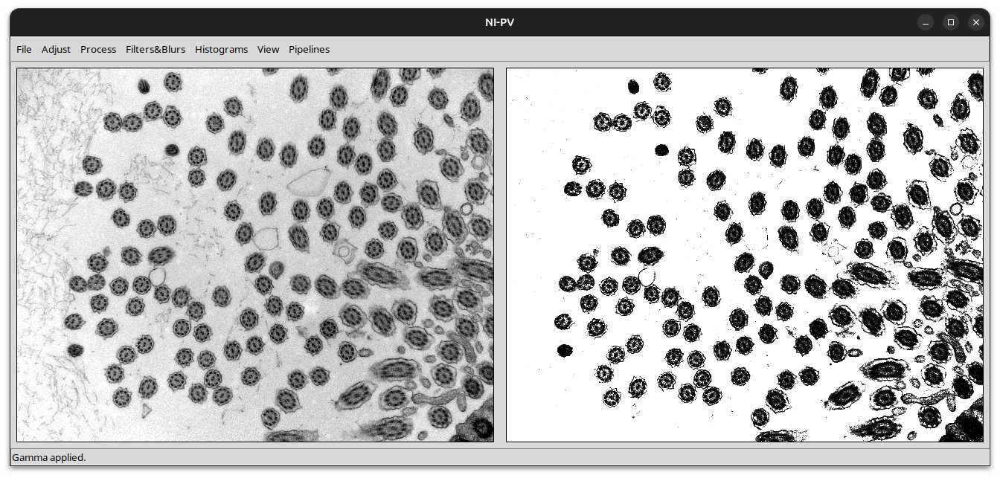
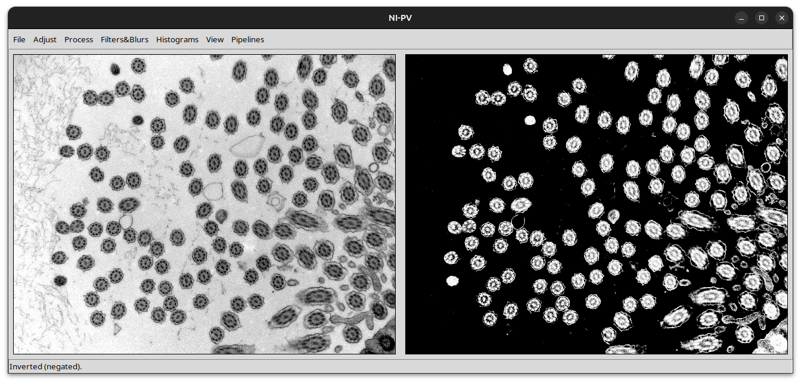
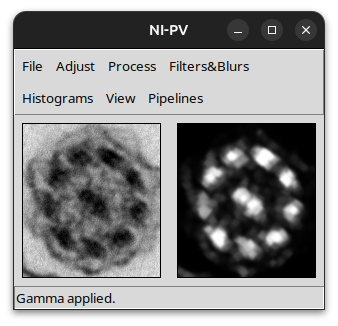
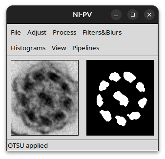

# Úkol č. 1

**Autor: Kryštof Čejchan**
## Úvod
V tomto dokumentu popisuji, čím se první úkol zabýval, jak jsem tento úkol řešil, a jaké jsou výsledky.

## Popis projektu

První projekt se zabývá využitím monadických a morfologických operací nad bitmapovými obrázky, jejich binarizací, a interpretací.


Na vstupu je grey-scale bitmapový obrázek.

1. Obrázek projde pre-processingem, který odstraní nežádoucí objekty z obrázku, a zvýrazní žádoucí objekty v obrázku.
2. Obrázek se zbinarizuje, přičemž požedované objekty jsou v bílé barvě, zbytek je černý
3. Z původního grey-scale obrázku se vyříznou ty části, které jsou na binárním obrázku bílé
4. Tyto části projdou další vlnou operací, přičemž na konci je opět binární obrázek; avšak nyní se jedná už danou "buňku"

V nadcházejících kapitolách popíši přesné operace, které byly testovány nebo využity.
## Popis programu
Tato kapitola se zabývá, jak lze daný Python skript spustit a jak program využívat.

**Upozornění: program má grafické uživatelské rozhraní, proto je potřeba mít naistalovanou knihovnu tkinter (https://docs.python.org/3/library/tkinter.html)**
### Spuštění programu
Program se spouští pomocí `main.py` souboru, který otevře GUI.


Nyní je program "prázdný" a nelze využívat jeho funkcionality.
### Používání programu
Prvně musíme vybrat vstupní obrázek pomocí `File>Open...`.
Poté lze využívat operace, které jsou v horním menu.

- **File**: slouží k otevírání a ukládání obrázků, a ukončení programu.
- **Adjust**: obsahuje primárně operace z první přednášky; tj. monadické operace
- **Process**: obsahuje primárně operace z druhé přednášky; tj. morfologické operace
- **Filters&Blurs**: obsahuje primárně operace z třetí přednášky; tj. filtry a rozmazávání obrázku
- **Histograms**: slouží k zobrazování histogramů a CDF (cumulative distribution function), a nabízí také operace spojené s histogramem (ekvivalizace a CLAHE)
- **View**: slouží ke smazání provedených operací na obrázku
- **Pipelines**: obsahuje předvytvořené posloupnosti operací pro splnění cíle zadání


### Orientace ve zdrojovém kódu
Tato podkapitola se zabývá strukturou projektu z pohledu zdrojového kódu a dalších potřebných adresářů.

- `./main.py` je spouštěcí skript, volá třídu `ImageEditorApp`, která spustí GUI
- `./image_editor_ui.py` obsahuje třídu s GUI komponentami (tlačítka, textová pole, apod.), tato třída také ukládá vstupní a editovaný obrázek. Bohužel je soubor velice obsáhlý, protože GUI obsahuje mnoho komponent.
- `./image_operations/*.py` obsahuje naimplementované operace, které byly testovány nebo použity
  - `monadic_operations.py` obsahuje monadické operace, např. negace, kvantizace, nebo úpravu jasu, gammy, kontrastu
  - `advanced_operations.py` obsahuje "pokročilejší" operace jako např. CLAHE, erosion, dilatation, opening, closing, hledání kontur, nebo dokonce rozdělení spojených "buněk"
  - `filters.py` obsahuje operace filtrování a rozmazání, např.: gaussian blur, difference of gaussians, laplacian of gaussian...
  - `pipelines.py` obsahuje předvytvořené sekvence operací, které se spustí za účelem splnění cíle úkolu
- `./utils/*.py` obsahuje pomocné metody, např pro převod mězi Float ⟨0,1⟩ -> uint8 ⟨0,255⟩, a obsahuje fukce pro výpočet histogramu a CDF


## Řešení úkolu
Díky implementaci GUI jsem měl možnost si hrát s různými operacemi, testovat jejich parametry, a přitom ihned vidět výsledek.
Při řešení jsem implemetovat několik pipeline, ovšem nakonec jsem ponechal pouze jednu, která měla nejlepší výsledky.
Každá pipeline obsahuje dvě části:
1) operace nad vstupním obrázek
2) operace nad ROI (rectangle of interest)
### Pipeline 1
Tato pipeline nakonec vzešla jako ta nejlepší.
```python
def pipeline1(img: np.ndarray) -> np.ndarray:
    im = img.copy() 
    im = adjust_brightness(im, brightness=0.4) #pre-processing
    im = adjust_gamma(im, gamma=0.1)
    im = clahe(im, clip_limit=3, tile_grid=16)
    for _ in range(30):
        im = median_filter(im, ksize=3)
    im = negate(im) # binarizace
    im = otsu(im)
    im = opening(im, 10) # post-processing
    return im
```
Funkce nejprve aplikuje dvě základní operace: zvýší jas a sníží gammu. Tyto dvě operace, ačkoliv jsou jednoduché, efektivně 
zajistí, že na obrázku zůstanou pouze ty nejvýraznější objekty, tj. v podstatě se smaže nežádaný šum na pozadí; viz. obrázek níže



Po použití CLAHE a median filtrů se vyhladí další drobný šum. (Median filter je v cyklu, protože OpenCV nedovoluje nastavit kernel size větší než 4)
Následuje negace a OTSU, které zajistí binarizaci.



Pro odstranění dalších nežádoucích objektů se použije opening, který tyto objekty "ořeže" natolik, že při hledání contour, se nezaznamenají.


Výsledkem tohoto je množina obdélníkových obrázků grey-scale buňek. Tyto obrázky projdou další fází: binarizací a hledáním jader v buňce.
```python
def roi_binarization1(img: np.ndarray) -> np.ndarray:
    im = img.copy()
    im = erosion(im, erosion_size=1, interations_no=3)
    im = gaussian_blur(im, ksize=5, sigma=0)
    im = negate(im)
    im = adjust_gamma(im, gamma=0.16)
    im = otsu(im)
    im = opening(im, size=4, shape=cv.MORPH_RECT, iterations_no=1)
    return im
```
Nejprve se spustí erosion, která zvýrazný a zvětší černé části obrázku; v našem případě se jedná o jádra buňky.


Dále se aplikuje gaussian filter, který decentně rozmaže černé tečky, které vznikly po erosion.
Po negaci obrázku se sníží gamma (kdyby se obrázek neznegoval, gamma by se dala zvýšit pro podobný efekt). Výsledkem úpravy gammy je
obrázek se zvýrazněnými bílými buňkami.



Po použití OTSU, je obrázek dokonán (alespoň v tomto případě); obecně to ale platit nemusí, proto ještě
použijeme opening. Opening se zde používá s tvarem `cv.MORPH_RECT`, protože bylo zjištěno, že obdélníkový tvar lépe
odděluje jádra, která jsou blízko u sebe, než elipsa.




Vzhledem k tomu, že u drtivé většiny obrázků, se prostřední dvě jádra spojí do jednoho, byla zvolena metoda, která do prostředního jádra
vloží černou úsečku. Viz. kód níže.
```python
def split_middle_cell(img, line_thickness=2):
    _, contours = find_contours(img, 30) #najde jádra
    h, w = img.shape[:2]
    cx, cy = w / 2.0, h / 2.0  

    best = None
    best_abs_d = float("inf")

    for c in contours: # pomocí pointPolygonTest, najde tu konturu, která je nejblíže středu obrázku
        d = cv.pointPolygonTest(c, (cx, cy), True)
        if abs(d) < best_abs_d:
            best_abs_d = abs(d)
            best = c

    middle_contour = best

    x, y, bw, bh = cv.boundingRect(middle_contour)
    x0 = max(0, x)
    y0 = max(0, y)
    x1 = min(w, x + bw)
    y1 = min(h, y + bh)

    y_line = int((y0 + y1) / 2)
    cv.line(img, (x0, y_line), (x1, y_line), (0, 0, 0), thickness=line_thickness) #do středu "namaluje" černou úsečku

    return img
```

Po celé pipeline se ještě musí očíslovat dané kontoury buněk. Celá pipeline a její výsledek pak vypadají takto:
```python
def apply_pipeline(self, pipeline_number: int, contour_rect_size:int, binarization_method:int, contour_bin_cell_size:int=150):
        fun = getattr(pipelines, f'pipeline{pipeline_number}')# vzhledej pipeline podle jména funkce
        self.edited = fun(self.original) # spusť pipeline na vstupním obrázu; výsledek ulož do upraveného obrázku
        self.extract_rects_current(contour_rect_size,10) #pomocí obdélníkových kontour najdi "buňky"
        self.last_rois_binary.clear() 
        for i in range(len(self.last_rois) - 1, -1, -1):#pro každou najitou buňku...
            roi = self.last_rois[i]
            fun_bin = getattr(pipelines, f'roi_binarization{binarization_method}')
            binarized_roi = fun_bin(roi) #...spusť binarizaci buňky
            binarized_roi = split_middle_cell(binarized_roi) #...rozděl prostřední buňku
            contours = self.find_contours(binarized_roi, contour_bin_cell_size) #..pomocí kontour najdi "jádra buňky"
             #odstraň vše, co není v konturách
            mask = np.zeros(binarized_roi.shape[:2], dtype=np.uint8)
            cv.drawContours(mask, contours, -1, 1, thickness=cv.FILLED)
            binarized_roi[mask == 0] = 0
            if not (len(contours)==11): #pokud je buňka vadná, tj. neobsahuje 11 jader, vymaž ji
                self.last_rois.pop(i)
                continue
            counting = 0
            for c in contours:
                # očíseluj jádra a do pravého horního rohu napiš celkový počet jader
                x, y, bw, bh = cv.boundingRect(c)
                h, w = binarized_roi.shape[:2]

                x0 = max(0, x)
                y0 = max(0, y)
                x1 = min(w - 1, x + bw)
                y1 = min(h - 1, y + bh)

                cx = int(x0 + (x1 - x0) / 2)
                cy = int(y0 + (y1 - y0) / 2)
                
                counting +=1

                cv.putText(binarized_roi, str(counting), (cx, cy), cv.FONT_HERSHEY_PLAIN,0.5, 0,1)
            cv.putText(binarized_roi, str(counting), (5, 5), cv.FONT_HERSHEY_PLAIN,0.5, 1,1)
            self.last_rois_binary.append(binarized_roi)
        self.save_rects_current() #otevře dialog pro vybrání cílového adresáře a uloží tam output (binarizované a grey-scale obrázky  = dataset)
```


### Přehled naimplementovaných operací
Základní **jednoobrázkové (monadické)** operace – mění vlastnosti jasu, kontrastu a intenzity pixelů.

| Metoda | Popis | Využití |
|--------|--------|----------|
| **`negate(img)`** | Inverzuje obraz (vymění světlé a tmavé oblasti). | Zvýraznění hran |
| **`adjust_gamma(img, gamma)`** | Provádí korekci gama — upravuje jas obrazu nelineárně. | Kompenzace rozdílů v osvětlení, zjasnění nebo ztmavení snímků. |
| **`adjust_brightness(img, brightness)`** | Lineárně přidává nebo ubírá jas. | Korekce podexponovaných nebo přeexponovaných obrazů. |
| **`adjust_contrast(img, contrast)`** | Mění kontrast vynásobením pixelových hodnot. | Zvýraznění detailů, zlepšení ostrosti. |
| **`non_linear_contrast(img, alpha)`** | Nelineární úprava kontrastu pomocí přechodu mezi světly a stíny. | Přirozenější zlepšení kontrastu než lineární metoda. |
| **`logarithmic_scale(img, s)`** | Logaritmická transformace jasu. | Zvýraznění detailů ve tmavých oblastech. |
| **`quantization(img, q)`** | Snížení počtu úrovní jasu (kvantizace). | Zmenšení velikosti obrazu, stylizace, předzpracování pro klasifikaci. |

---
Kolekce **filtračních a hranových metod** – slouží k odstranění šumu, rozostření nebo zvýraznění struktur.

| Metoda | Popis | Využití |
|--------|--------|----------|
| **`mean_blur(img, ksize)`** | Průměrovací filtr. | Zmírnění šumu, vyhlazení obrazu. |
| **`gaussian_blur(img, ksize, sigma)`** | Gaussovské rozostření. | Potlačení šumu, odstranění detailů před segmentací. |
| **`median_filter(img, ksize)`** | Mediánový filtr. | Odstranění impulsního („salt & pepper“) šumu bez rozmazání hran. |
| **`bilateral_filter(img, d, sigma_color, sigma_space)`** | Bilaterální filtr – zachovává hrany při vyhlazování. | Redukce šumu při zachování kontur buněk nebo objektů. |
| **`canny(img, threshold1, _, threshold2)`** | Canny detektor hran. | Detekce hran a tvarů buněk, objektů nebo struktur. |
| **`diff_of_gaus(img, sigma, k)`** | Rozdíl dvou Gaussů (DoG). | Zvýraznění hran podobně jako Laplace, často v biologickém zpracování. |
| **`laplacian_of_gaus(img, sigma, ksize_lap)`** | Laplace filtr po Gaussovském rozostření (LoG). | Detekce hran a přechodů intenzity s menším šumem. |

---
Pokročilé **morfologické a segmentační** metody – užitečné pro analýzu buněk, objektů a tvarů.

| Metoda                                     | Popis                                                   | Využití                                                     |
|--------------------------------------------|---------------------------------------------------------|-------------------------------------------------------------|
| **`hist_equalization(img)`**               | Normalizace histogramu – vyrovná jas a kontrast.        | Zlepšení viditelnosti detailů.                              |
| **`clahe(img, clip_limit, tile_grid)`**    | Adaptivní ekvalizace histogramu.                        | Vyrovnání kontrastu u nehomogenně osvětlených snímků.       |
| **`erosion(img, size)`**                   | Eroze – zmenší světlé oblasti.                          | Odstranění drobných šumů nebo oddělení blízkých objektů.    |
| **`dilatation(img, size)`**                | Dilatace – rozšíří světlé oblasti.                      | Vyplnění mezer, zvýraznění struktur.                        |
| **`opening(img, size)`**                   | Otevření (eroze + dilatace).                            | Odstranění malých šumových bodů při zachování tvarů.        |
| **`closing(img, size)`**                   | Uzavření (dilatace + eroze).                            | Vyhlazení hran, odstranění malých tmavých děr.              |
| **`otsu(img)`**                            | Otsuův algoritmus pro automatickou prahovou segmentaci. | Automatické rozdělení obrazu na pozadí a objekty.           |
| **`find_contours(img, min_area)`**         | Najde obrysy (kontury) objektů.                         | Extrakce tvarů buněk nebo částic.                           |
| **`save_rect_images(rect_imgs, out_dir)`** | Uloží oříznuté oblasti jako samostatné snímky.          | Export jednotlivých objektů pro dataset.                    |
| **`split_middle_cell(img)`**               | Najde a rozdělí centrální buňku čarou.                  | Pomoc při separaci spojených buněk.                         |
| **`image_reconstruct(marker, img)`**       | Morfologická rekonstrukce.                              | Obnovení objektů z poškozených nebo částečně smazaných dat. |

---
## Výsledky
V následujicí tabulce popisuji, jak ve výsledku dopadl můj projekt.

| Název obrázku     | Počet "buněk" | Počet vadných buněk | Procento vadných | Konečný počet buněk |
|-------------------|---------------|---------------------|------------------|---------------------|
| PCD1.tiff         | 69            | 3                   | 4.34%            | 66                  |
| PCD2.tiff         | 18            | 7                   | 38.88%           | 11                  |
| PCD3.tiff         | 50            | 2                   | 4.00%            | 48                  |
| Tv8.tiff          | 18            | 0                   | 0.00%            | 18                  |
| Tv11.tiff         | 66            | 5                   | 8.12%            | 61                  |
| Tv17.tiff         | 24            | 3                   | 12.50%           | 21                  |
| Tv21.tiff         | 29            | 1                   | 3.44%            | 28                  |
| Tv31.tiff         | 30            | 5                   | 16.66%           | 25                  |
| Tv33.tiff         | 37            | 0                   | 0.00%            | 37                  |
| **SOUČET/PRŮMĚR** | **341**       | **26**              | **7.63%**        | **315**             |
